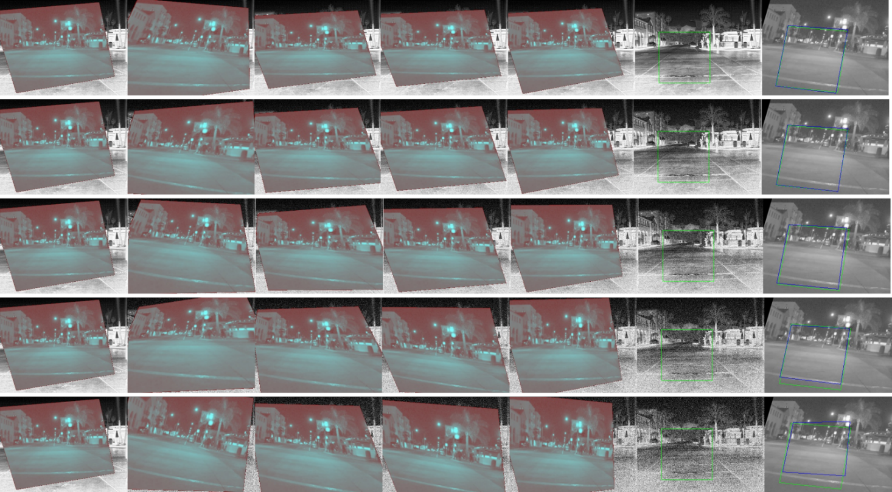
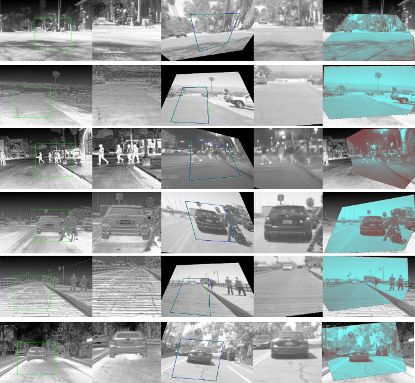

# Dense-Cascade-Neural-Network-For-Thermal-and-Visible-Image-Registration
* **Dense-Cascade Neural Network For Thermal and Visible Image Registration**

* [Paper](./paper/2023129340.pdf)

* **Comparison of registration results**

  From left to right: Target, PFNet, DHN, DHN-Two-Branch, Ours(4Modules), thermal image, visible image

* **Registration example**

  
